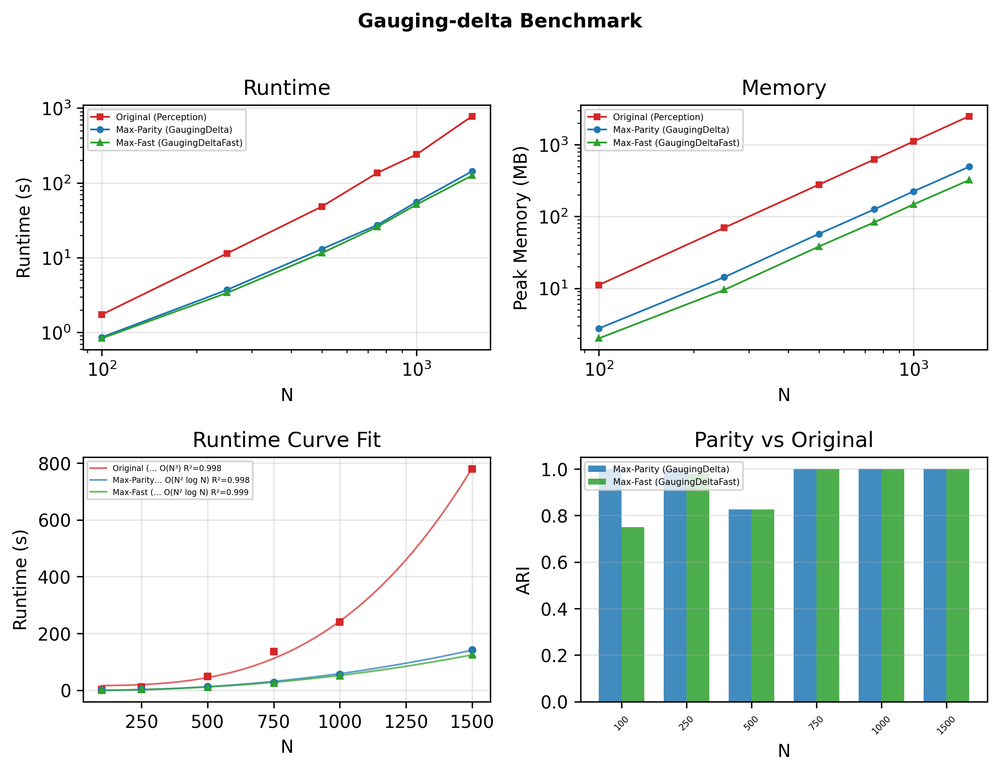

<div align="center">

# Gauging-δ

### A Non-Parametric Hierarchical Clustering Algorithm

[](https://www.python.org/downloads/)
[](LICENSE)
[](https://doi.org/10.1109/TPAMI.2025.3545573)

*Adaptive hierarchical clustering through proximity statistics and continuity analysis*

[Installation](#installation) · [Quick Start](#quick-start) · [API Reference](#api-reference) · [Citation](#citation)

</div>

---

## Overview

**Gauging-δ** is a novel hierarchical clustering algorithm that automatically determines the optimal number of clusters without requiring user-specified parameters. Unlike traditional methods (k-means, DBSCAN), Gauging-δ adapts to local data density and geometric structure through:

- **Proximity Statistics (ρ)** — Measures relative cluster distances against historical merge patterns
- **Adaptive Thresholds (T)** — Dynamically adjusts mergeability criteria based on environmental context
- **Continuity Analysis** — Evaluates density transitions and angular smoothness between cluster boundaries

<div align="center">


</div>

### Key Features

| Feature | Description |
|---------|-------------|
| **Non-parametric** | No need to specify k or ε — clusters emerge naturally |
| **Scalable** | Sparse neighbor graph with O(N log N) complexity |
| **Robust** | Handles arbitrary cluster shapes, noise, and varying densities |
| **N-dimensional** | Works with any feature dimensionality |

---

## Performance

Three implementation variants are benchmarked across dataset sizes from 100 to 10,000 points:

| Variant | Description | Parity (ARI) | Complexity |
|---------|-------------|:------------:|------------|
| **Original** | `perception.py` baseline | — | O(N³+) time, O(N²) space |
| **Max-Parity** | `GaugingDelta` — refactored | **1.000** | O(N²) time, O(N²) space |
| **Max-Fast** | `GaugingDeltaFast` — vectorized + KDTree | ≥ 0.95 | O(N²) init, O(N·k) merge |

<div align="center">



</div>

Run the benchmark yourself (designed for overnight execution):

```bash
uv sync --extra bench
uv run python benchmarks/benchmark_all.py
```

---

## Installation

### Using uv (recommended)

```bash
uv add gauging-delta
```

### From source

```bash
git clone https://github.com/design-zeng/Gauging-delta.git
cd Gauging-delta
uv sync
```

### Development installation

```bash
uv sync --all-extras
```

---

## Quick Start

### Basic Usage

```python
import numpy as np
from gauging_delta import GaugingDelta

# Generate sample data
np.random.seed(42)
X = np.vstack([
    np.random.randn(100, 2) + [0, 0],
    np.random.randn(100, 2) + [5, 5],
    np.random.randn(100, 2) + [10, 0],
])

# Fit the model
model = GaugingDelta()
labels = model.fit(X)

print(f"Discovered {model.n_clusters_} clusters")
```

### With Target Number of Clusters

```python
# Force exactly k clusters
model = GaugingDelta(k=3)
labels = model.fit(X)
```

### Loading Data from Files

```python
import numpy as np
from gauging_delta import GaugingDelta

# Load comma-separated data (last column may be ground truth)
data = np.loadtxt("data/aggregation.txt", delimiter=",")
X = data[:, :-1]  # Features
y_true = data[:, -1]  # Ground truth labels (optional)

model = GaugingDelta()
labels = model.fit(X)
```

---

## API Reference

### `GaugingDelta`

The main clustering class.

```python
GaugingDelta(
    k: int | None = None,
    threshold_continuity: float = 0.15,
    n_neighbors: int = 5,
    graph_neighbors: int = 50,
)
```

#### Parameters

| Parameter | Type | Default | Description |
|-----------|------|---------|-------------|
| `k` | `int \| None` | `None` | Target number of clusters. If `None`, determined automatically. |
| `threshold_continuity` | `float` | `0.15` | Continuity threshold T_c for merge decisions. |
| `n_neighbors` | `int` | `5` | Number of neighboring clusters for environmental context. |
| `graph_neighbors` | `int` | `50` | k-nearest neighbors for sparse graph construction. |

#### Methods

| Method | Returns | Description |
|--------|---------|-------------|
| `fit(X)` | `np.ndarray` | Fit the model and return cluster labels. |
| `fit_predict(X)` | `np.ndarray` | Alias for `fit()`. |

#### Attributes (after fitting)

| Attribute | Type | Description |
|-----------|------|-------------|
| `labels_` | `np.ndarray` | Cluster label for each sample. |
| `n_clusters_` | `int` | Number of clusters found. |
| `clusters_` | `dict` | Dictionary of `Cluster` objects. |

---

## Algorithm Overview

Gauging-δ implements a hierarchical agglomerative clustering approach with adaptive merge criteria:

```
Algorithm 1: Gauging-δ Clustering
─────────────────────────────────────────────────────────
Input: Data X ∈ ℝ^(n×d)
Output: Cluster labels y ∈ ℤ^n

1. Initialize each point as its own cluster
2. Build sparse k-NN neighbor graph
3. while merge candidates exist:
    4.   Extract closest cluster pair (C_i, C_j) from heap
    5.   Compute proximity statistic ρ = d_ij / μ_historical
    6.   Compute adaptive thresholds T_i, T_j
    7.   if ρ ≤ min(T_i, T_j):
    8.       Compute continuity score
    9.       if continuity > T_c:
    10.          Merge C_i and C_j
    11.          Update neighbor graph
12. Return cluster assignments
```

### Mathematical Foundation

**Proximity Statistic (Eq. 3)**
```
ρ = d_ij / μ_historical
```

**Adaptive Threshold (Eq. 4)**
```
T = β_ij × T_stat × ξ_s
```

Where:
- `β_ij` — Environmental scaling factor based on neighboring cluster forces
- `T_stat` — Statistical threshold from merge history distribution  
- `ξ_s` — Shape similarity factor between clusters

---

## Datasets

The `data/` directory contains benchmark datasets evaluated in the paper:

| Dataset | Points | Clusters | Description |
|---------|--------|----------|-------------|
| `3-spiral.txt` | 312 | 3 | Interleaved spirals |
| `3_blobs.txt` | 300 | 3 | Gaussian blobs |
| `aggregation.txt` | 788 | 7 | Mixed shapes |
| `atom.txt` | 800 | 2 | Nested structures |
| `chainlink.txt` | 1000 | 2 | Linked rings |
| `compound.txt` | 399 | 6 | Compound shapes |
| `flame.txt` | 240 | 2 | Flame pattern |
| `jain.txt` | 373 | 2 | Crescent moons |
| `lsun.txt` | 400 | 3 | L-shaped clusters |
| `pathbased.txt` | 300 | 3 | Path-connected |

**Data Format**: CSV with coordinates in columns 1 to d, optional ground truth label in last column.

---

## Project Structure

```
Gauging-delta/
├── src/gauging_delta/
│   ├── core/
│   │   ├── algorithm.py      # Main GaugingDelta class
│   │   ├── cluster.py        # Cluster data structures
│   │   └── neighbor_graph.py # Sparse k-NN graph
│   ├── geometry/
│   │   ├── angles.py         # Angle calculations
│   │   └── spatial.py        # KDTree spatial queries
│   ├── mergeability/
│   │   ├── proximity.py      # ρ computation
│   │   ├── threshold.py      # T, β, F, ξ computation
│   │   └── continuity.py     # Continuity analysis
│   ├── utils/
│   │   └── math_utils.py     # Safe division, sigmoid, clamp
│   └── visualization/
│       └── plotter.py        # Matplotlib cluster plots
├── benchmarks/
│   ├── benchmark_all.py      # Runtime, space & parity benchmarks
│   └── test_performance.py   # Pytest-based performance tests
├── tests/                    # Comprehensive test suite
└── data/                     # Benchmark datasets
```

---

## Development

### Setup

```bash
# Clone and install with dev dependencies
git clone https://github.com/design-zeng/Gauging-delta.git
cd Gauging-delta
uv sync --extra dev

# Install pre-commit hooks
pre-commit install
```

### Available Commands

```bash
make help        # Show all available commands
make test        # Run test suite
make lint        # Run linter (ruff)
make format      # Format code (ruff)
make typecheck   # Run type checker (mypy)
make check       # Run all checks (lint, typecheck, test)
```

### Code Quality Tools

| Tool | Purpose | Config |
|------|---------|--------|
| **Ruff** | Linting & formatting | `pyproject.toml` |
| **Mypy** | Static type checking | `pyproject.toml` |
| **Pytest** | Testing framework | `pyproject.toml` |
| **Pre-commit** | Git hooks | `.pre-commit-config.yaml` |
| **Bandit** | Security scanning | `pyproject.toml` |

---

## Citation

If you use Gauging-δ in your research, please cite:

```bibtex
@article{yao2025gauging,
  title     = {Gauging-$\delta$: A Non-Parametric Hierarchical Clustering Algorithm},
  author    = {Yao, Jinli and Pan, Jie and Zeng, Yong},
  journal   = {IEEE Transactions on Pattern Analysis and Machine Intelligence},
  year      = {2025},
  volume    = {47},
  number    = {6},
  pages     = {4897--4907},
  doi       = {10.1109/TPAMI.2025.3545573},
  publisher = {IEEE}
}
```

---

## License

This project is licensed under the MIT License — see the [LICENSE](LICENSE) file for details.

---

<div align="center">

**[⬆ Back to Top](#gauging-δ)**

</div>
