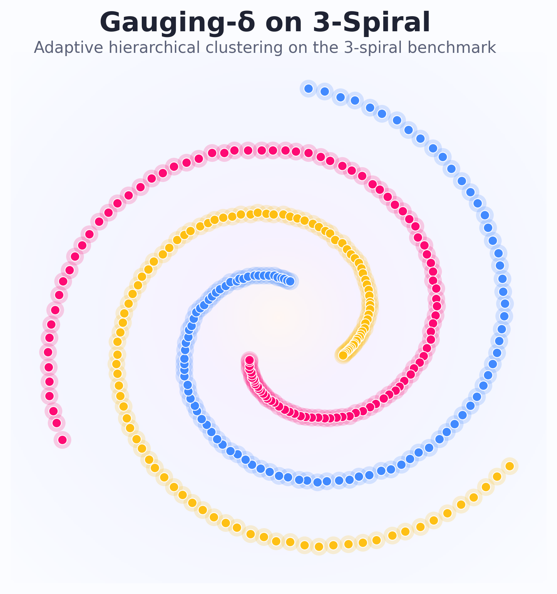
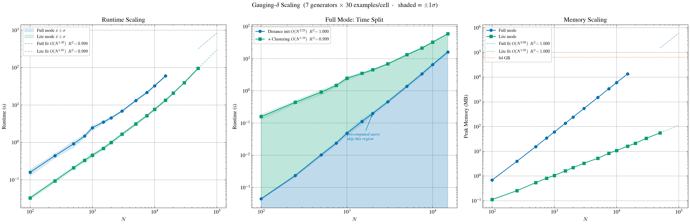
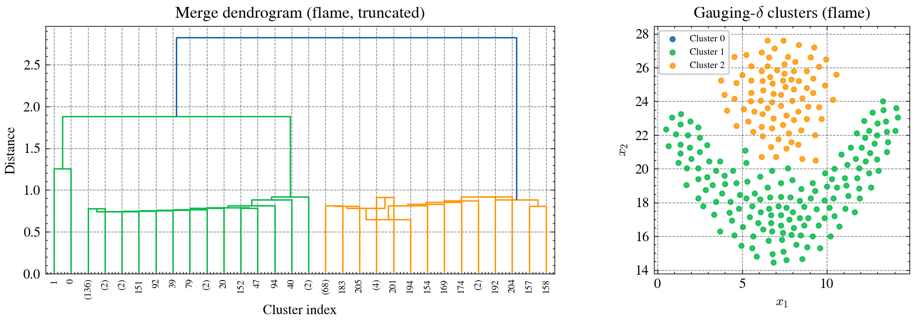

<div align="center">

# Gauging-δ

[](https://www.python.org/downloads/)
[](LICENSE)
[](https://doi.org/10.1109/TPAMI.2025.3545573)
[](#)
[](#api-reference)

</div>

**Gauging-δ** is a hierarchical agglomerative clustering algorithm that automatically
determines the number of clusters. Instead of fixed distance thresholds, it evaluates
merge candidates through *relative proximity* — inter-cluster distance normalized by
historical merge patterns — and validates boundaries with adaptive thresholds and
angle-based continuity analysis.

> Published in [IEEE TPAMI 2025](https://doi.org/10.1109/TPAMI.2025.3545573) (Vol. 47, No. 6, pp. 4897–4907).

<div align="center">



</div>

## Install

```bash
git clone -b refactor/time-space-complexity-optimization https://github.com/design-zeng/Gauging-delta.git
cd Gauging-delta && uv sync
```

## Quick Start

```python
from gauging_delta import GaugingDelta

labels = GaugingDelta().fit_predict([
    [0.0, 0.0], [0.5, 0.3], [0.2, 0.1],
    [8.0, 8.0], [8.5, 8.3], [8.2, 8.1],
])
# array([0, 0, 0, 1, 1, 1])
```

## Usage

### Automatic clustering

```python
import numpy as np
from gauging_delta import GaugingDelta

# X is any array-like: list, numpy array, or pandas DataFrame
X = np.vstack([
    np.random.randn(100, 2) + [0, 0],
    np.random.randn(100, 2) + [5, 5],
    np.random.randn(100, 2) + [10, 0],
])

model = GaugingDelta().fit(X)
print(model.labels_)       # cluster label per sample
print(model.n_clusters_)   # number of clusters found
```

### Target a specific number of clusters

```python
model = GaugingDelta(n_clusters=3).fit(X)
assert model.n_clusters_ == 3
```

### Lite mode for large datasets

```python
model = GaugingDelta(mode="lite").fit(X)
```

Lite mode uses centroid linkage and skips continuity analysis.
Linear memory — scales to millions of points on commodity hardware.
See [Scaling](#scaling) for projections.

### Custom distance metric

```python
# Any scipy metric string
model = GaugingDelta(metric="cosine").fit(X)
model = GaugingDelta(metric="cityblock").fit(X)

# Or a callable (must satisfy the triangle inequality)
model = GaugingDelta(metric=lambda u, v: np.sum(np.abs(u - v))).fit(X)
```

The `metric` parameter works in both full and lite modes.

### Disable continuity gate

```python
# Full mode without continuity analysis (faster, fewer merge gates)
model = GaugingDelta(continuity=False).fit(X)
```

By default, full mode uses angle-based continuity analysis to validate
cluster boundaries. Setting `continuity=False` disables this gate —
merges are decided by proximity and adaptive threshold only (same as
lite mode, but with single-linkage distances).

### Precomputed distance matrix

```python
from scipy.spatial.distance import pdist, squareform

# Square (N, N) matrix
D = squareform(pdist(X, metric="cosine"))
model = GaugingDelta(metric="precomputed").fit(D)

# Or condensed 1-D vector directly from pdist
model = GaugingDelta(metric="precomputed").fit(pdist(X))
```

Accepts square matrices, condensed vectors, and DataFrames.
Requires `mode="full"` (default); continuity is automatically disabled.

### Works with any array-like input

`fit(X)` accepts anything NumPy can convert — lists, arrays, DataFrames:

```python
import pandas as pd

df = pd.DataFrame({"x": [1, 3, 10, 12], "y": [2, 4, 11, 13]})
labels = GaugingDelta().fit_predict(df)
```

## Scaling

<div align="center">



</div>

|  | Runtime | Space |
|---|---|---|
| **Distance matrix** | O(N^2.23) | O(N²) |
| **Core algorithm** | O(N^1.19) | — |
| **Core algorithm (lite)** | O(N^1.65) | O(N) |

Full mode total runtime is dominated by the distance matrix at large N.
Users who supply a precomputed distance matrix (`metric="precomputed"`) skip
the distance-init phase entirely — their runtime is the "core algorithm" row only.

| N | Full total | (dist init) | Full memory | Lite total | Lite memory |
|---:|---:|---:|---:|---:|---:|
| 5,000 | 13.2 ± 0.8 s | 1.4 ± 0.1 s | 1.5 GB | 3.1 ± 0.3 s | 5 MB |
| 10,000 | 32.5 ± 1.2 s | 6.6 ± 0.5 s | 6.0 GB | 7.6 ± 0.6 s | 11 MB |
| 15,000 | 60.0 ± 2.8 s | 16.1 ± 1.5 s | 13.5 GB | 13.5 ± 0.7 s | 16 MB |
| 20,000 | ~1.5 min | ~31 s | ~24 GB | 20.8 ± 0.7 s | 21 MB |
| 30,000 | ~2.6 min | ~1.3 min | ~54 GB | 39.6 ± 1.6 s | 34 MB |
| 35,000 | ~3.2 min | ~1.8 min | **~74 GB** | ~53 s | ~39 MB |
| 50,000 | ~5.3 min | ~3.9 min | **~150 GB** | 95.4 ± 4.9 s | 55 MB |
| 100,000 | ~14 min | ~19 min | **~599 GB** | ~5.0 min | ~113 MB |
| 500,000 | ~2.2 hr | ~11.2 hr | **~14.9 TB** | ~70 min | ~583 MB |
| 1,000,000 | ~5.7 hr | ~52.7 hr | **~59.7 TB** | ~3.7 hr | ~1.2 GB |

Rows up to N=15,000 (full) and N=50,000 (lite) are measured (median ± std over
30 runs across 7 dataset generators). Larger rows are power-law extrapolations
(R² > 0.998).¹

Full mode memory is O(N²) — exceeds 64 GB at N ≈ 35K.
Lite mode memory is O(N) — feasible to millions of points on commodity hardware.

<sub>¹ Benchmarked on 10-core ARM SoC (4P + 6E), 32 GB unified memory.</sub>

## Modes

|  | `"full"` (default) | `"lite"` |
|---|---|---|
| **Linkage** | Single-link (point-to-point) | Centroid (center-to-center) |
| **Continuity** | On (toggleable via `continuity=False`) | Off |
| **Merge gates** | Proximity + threshold + continuity | Proximity + threshold |
| **Quality** | Paper-exact (ARI = 1.000 on benchmarks) | Lower — tends to under-merge |
| **Memory** | O(N²) | O(N) |
| **Practical limit** | ~35K samples (64 GB) | Millions |
| **Use when** | Quality matters | Scale or memory matters |

The `mode` parameter bundles linkage and continuity defaults. You can
override continuity independently — see [Disable continuity gate](#disable-continuity-gate).

> Lite mode trades clustering quality for O(N) memory. It is best suited for
> large-scale exploratory analysis where approximate clusters are acceptable.
> For publication-quality results, use full mode.

## API Reference

### Constructor

```python
GaugingDelta(
    *,
    n_clusters=None,
    mode="full",
    metric="euclidean",
    continuity=None,
    config=None,
    preserve_labels=False,
)
```

All parameters are keyword-only.

| Parameter | Type | Default | Description |
|---|---|---|---|
| `n_clusters` | `int \| None` | `None` | Target cluster count. `None` = automatic. |
| `mode` | `str` | `"full"` | `"full"` or `"lite"`. See [Modes](#modes). |
| `metric` | `str \| callable` | `"euclidean"` | Distance metric. Accepts any [scipy metric](https://docs.scipy.org/doc/scipy/reference/generated/scipy.spatial.distance.cdist.html) (`"cosine"`, `"cityblock"`, `"minkowski"`, ...), a callable `f(u, v) -> float`, or `"precomputed"` (pass a distance matrix to `fit`). Must satisfy the triangle inequality. |
| `continuity` | `ContinuityMetric \| False \| None` | `None` | Continuity gate. `None` = mode default (on for full, off for lite). `False` = disabled. A `ContinuityMetric` instance provides a custom implementation. |
| `config` | `GaugingDeltaConfig \| None` | `None` | Algorithm constants. |
| `preserve_labels` | `bool` | `False` | Keep internal cluster IDs instead of renumbering to 0..k-1. |

<details>
<summary>Advanced: swappable components</summary>

| Parameter | Type | Default | Description |
|---|---|---|---|
| `proximity` | `ProximityMetric \| None` | `None` | Custom proximity metric. |
| `linkage` | `LinkageMetric \| None` | `None` | Custom linkage metric. Full mode: single-linkage. Lite mode: centroid-linkage. |

These accept Protocol-compatible objects. See `src/gauging_delta/_types.py` for the protocol definitions.
</details>

<details>
<summary>Methods and attributes</summary>

### Methods

| Method | Returns | Description |
|---|---|---|
| `fit(X)` | `self` | Fit the model. *X* is array-like of shape *(n_samples, n_features)*. |
| `fit_predict(X)` | `np.ndarray` | Fit and return cluster labels. |
| `get_params()` | `dict` | Get estimator parameters (sklearn `BaseEstimator`). |
| `set_params(**params)` | `self` | Set estimator parameters (sklearn `BaseEstimator`). |

### Attributes (available after `fit`)

| Attribute | Type | Description |
|---|---|---|
| `labels_` | `np.ndarray` | Cluster label for each sample, shape *(n_samples,)*. |
| `n_clusters_` | `int` | Number of clusters found. |
| `cluster_centers_` | `np.ndarray` | Centroid of each cluster, shape *(n_clusters_, n_features)*. Not set for `metric='precomputed'`. |
| `n_features_in_` | `int` | Number of features seen during `fit`. |
| `children_` | `np.ndarray` | Merge tree, shape *(n_samples-1, 2)*. Each row `[i, j]` records a merge. |
| `distances_` | `np.ndarray` | Distance at each merge, shape *(n_samples-1,)*. |
| `n_leaves_` | `int` | Number of leaves (= *n_samples*). |
| `linkage_matrix_` | `np.ndarray` | Scipy-compatible *(n_samples-1, 4)* linkage matrix for dendrograms. |

</details>

### Dendrogram

> Requires matplotlib: `uv add gauging-delta[bench]`

```python
from scipy.cluster.hierarchy import dendrogram
import matplotlib.pyplot as plt

model = GaugingDelta().fit(X)
dendrogram(model.linkage_matrix_)
plt.show()
```

<div align="center">



</div>

### Pipeline

```python
from sklearn.pipeline import Pipeline
from sklearn.preprocessing import StandardScaler

pipe = Pipeline([("scaler", StandardScaler()), ("cluster", GaugingDelta())])
labels = pipe.fit_predict(X)
```

## Citation

If you use Gauging-δ in your research, please cite:

```bibtex
@article{yao2025gauging,
  title     = {Gauging-$\delta$: A Non-Parametric Hierarchical Clustering Algorithm},
  author    = {Yao, Jinli and Pan, Jie and Zeng, Yong},
  journal   = {IEEE Transactions on Pattern Analysis and Machine Intelligence},
  year      = {2025},
  volume    = {47},
  number    = {6},
  pages     = {4897--4907},
  doi       = {10.1109/TPAMI.2025.3545573},
  publisher = {IEEE}
}
```

## License

MIT — see [LICENSE](LICENSE).
