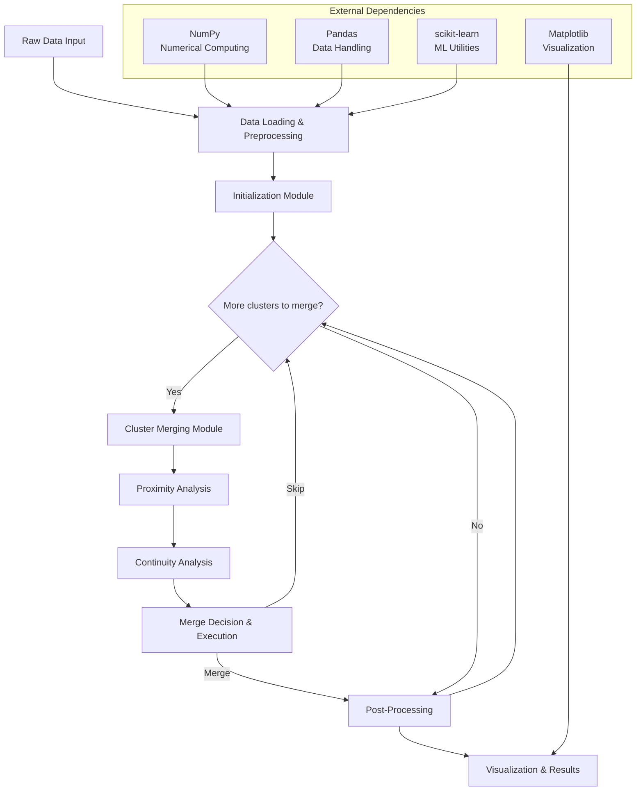

# Gauging-delta Clustering Algorithm

## Overview

The Gauging-delta algorithm is a non-parametric hierarchical clustering approach that combines proximity analysis with continuity-based geometric evaluation. The implementation processes multi-dimensional data through a sophisticated pipeline that evaluates both distance-based relationships and geometric continuity to determine optimal cluster merging decisions.

The algorithm consists of [[Narrative - Multi-Format Data Ingestion|data ingestion and formatting]], [[Narrative - Distance Matrix Foundation|distance matrix computation and cluster setup]], [[Cluster Merging Module/Narrative - Context-Aware Proximity Filtering|distance-based relationship evaluation]], [[Cluster Merging Module/Narrative - Continuity-Based Mergeability|geometric continuity assessment]], [[Narrative - Decision Logic Orchestration|decision logic and cluster combination]], [[Narrative - Result Refinement & Export|final result generation]], [[Narrative - Multi-Panel Visualization|plotting and output]], and [[Narrative - Computational Mathematics Foundation|computational helpers]].

## Algorithm Flow

## Key Innovation

The algorithm's core innovation lies in its dual-criteria merging decision process that combines:
- **Proximity Analysis**: Adaptive threshold-based distance evaluation with contextual awareness
- **Continuity Analysis**: Geometric continuity assessment using angular transitions and local shape analysis

This approach enables the algorithm to handle complex cluster shapes and varying densities without requiring predefined cluster counts or parameter tuning.

## Module Dependencies

- [[Narrative - Multi-Format Data Ingestion]] → [[Narrative - Distance Matrix Foundation]] (provides formatted data)
- [[Narrative - Distance Matrix Foundation]] → [[Cluster Merging Module/Narrative - Context-Aware Proximity Filtering]] (provides distance matrices)
- [[Cluster Merging Module/Narrative - Context-Aware Proximity Filtering]] → [[Cluster Merging Module/Narrative - Continuity-Based Mergeability]] (provides cluster pairs)
- [[Cluster Merging Module/Narrative - Continuity-Based Mergeability]] → [[Narrative - Decision Logic Orchestration]] (provides continuity metrics)
- [[Narrative - Decision Logic Orchestration]] → [[Narrative - Result Refinement & Export]] (provides final clusters)
- [[Narrative - Computational Mathematics Foundation]] → All modules (provides computational functions)

## Implementation Scale

- **Primary Algorithm**: ~1,650 lines in `perception.py`
- **Supporting Code**: ~400 lines across utility modules
- **Test Datasets**: 10 synthetic datasets for evaluation
- **Supported Formats**: TXT, CSV, Excel, ARFF, H5, UCI repository
