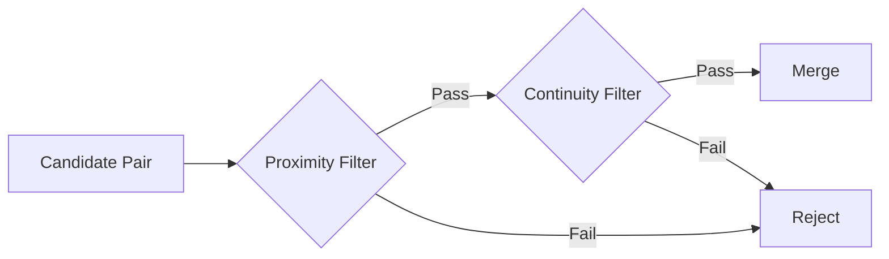

# Computational Mathematics Foundation

> [!TIP] Module Purpose
> This module provides **pure mathematical functions** that power the clustering algorithm's decision-making. Each calculator is stateless and focused on a single computation.

---

## Two-Phase Filtering Architecture

The algorithm uses a **two-stage pipeline** where candidate cluster pairs pass through:



---

## Proximity Components

These utilities determine if clusters are **close enough** to merit deeper analysis:

| Component | Purpose | Complexity |
|-----------|---------|------------|
| [[Adaptive Mergeability Threshold]] | Dynamic thresholds from history + context | $O(k)$ |
| [[Perceptual Proximity Statistic]] | Scale-invariant distance normalization | $O(n)$ |
| [[Interaction Force Calculator]] | Inverse-square force for environment factor | $O(1)$ |
| [[Shape Similarity Calculator]] | **Proximity threshold strictness modifier** | $O(N_{hist})$ |

---

## Continuity Components

The continuity score determines if clusters have **compatible structure** at their boundary.

### Scoring Formula

> [!IMPORTANT] Code Implementation
> The Code uses a **multiplicative "weakest link"** approach (not weighted averaging):
> 
> ```python
> # perception.py Line 836
> smoothness = min(transition_smoothness * orientation_smoothness, 1)
> ```

Where:
- `transition_smoothness` ($\xi_d$) — from [[Density Continuation Calculator]]
- `orientation_smoothness` ($\xi_o$) — from [[Orientation Similarity Calculator]]

This can be expressed as:

$$
\text{smoothness} = \min\left(\xi_d \times \sqrt{\text{mass\_smoothness} \times \text{angle\_smoothness}}, 1\right)
$$

> [!WARNING] Paper Divergence
> The Paper uses a different formulation: $\xi_d \cdot \sqrt{\xi_a \cdot \xi_o}$ with Shape Similarity included.
> The Code separates Shape Similarity into threshold adjustments and uses a multiplicative combination where any poor component can block merging.

### Component Summary

| Component | Symbol | Purpose | Code Function |
|-----------|--------|---------|---------------|
| [[Density Continuation Calculator]] | $\xi_d$ | Transition smoothness via internal/external counts | `compute_transition_smoothness` |
| [[Orientation Similarity Calculator]] | $\xi_o$ | Geometric mean of mass + angle smoothness | Calculated in `compute_local_transition` |
| [[Angle Transition Calculator]] | $\xi_a$ | Mean normalized angular deviation | `compute_angle_transition_2` |
| [[Local Compactness Measure]] | $\tau$ | Internal cohesion metric | — |

---

## Key Design Principles

| Principle | Description |
|-----------|-------------|
| **Multiplicative Scoring** | Poor components can veto merging (unlike averaging which can hide weaknesses) |
| **Bounded Output** | `min(..., 1)` ensures scores stay in [0, 1] range |
| **Geometric Mean** | Used for orientation_smoothness to require both factors to be good |
| **Pure Functions** | Stateless computations, no side effects |

---

## Related Modules

- [[Initialization Module/Narrative - Distance Matrix Foundation|Distance Matrix Foundation]] — geometric primitives & distance operations
- [[Narrative - Decision Logic Orchestration|Decision Logic Orchestration]] — algorithm execution flow
